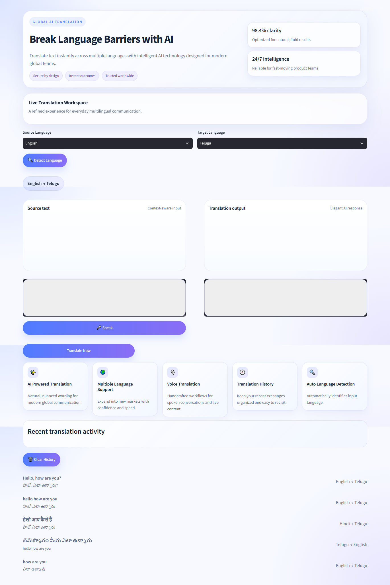
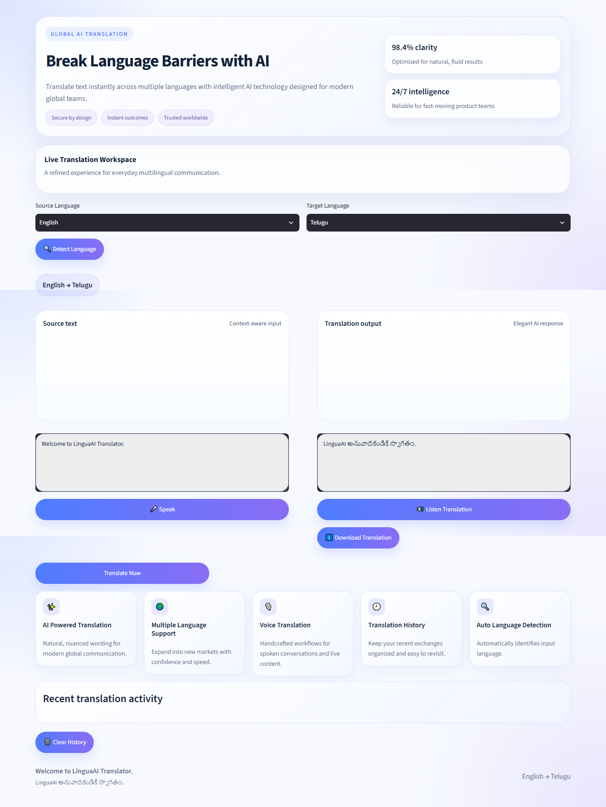
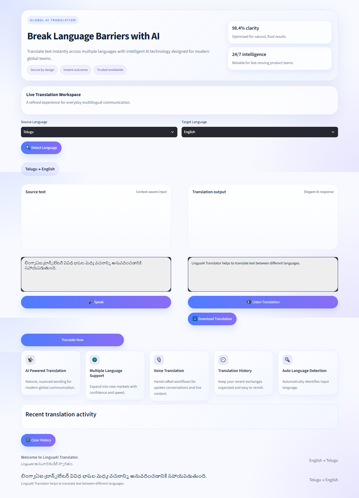
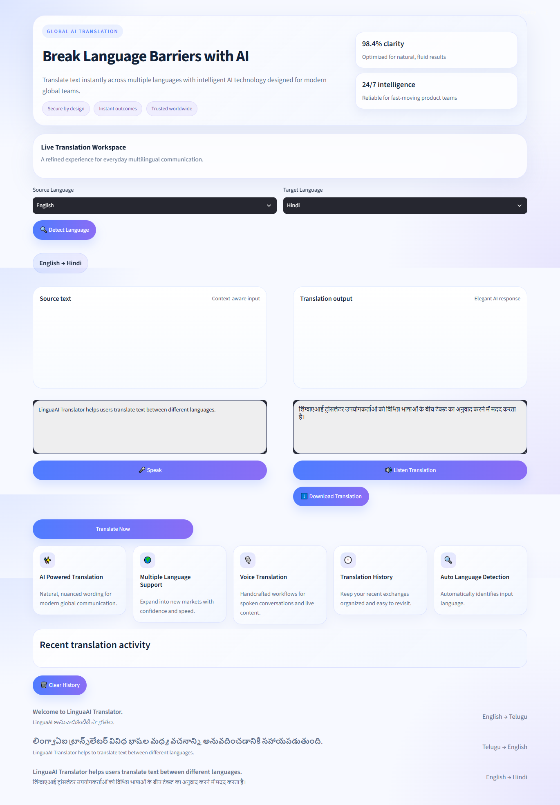
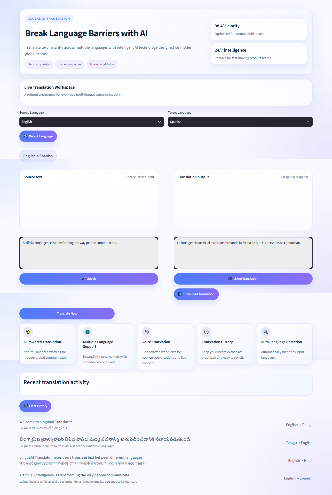
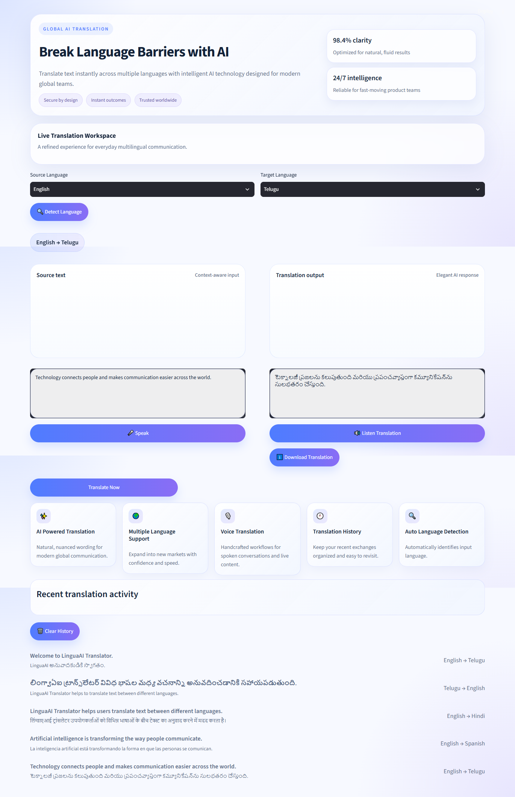

# 🌐 LinguaAI Translator

An AI-powered **Language Translation Platform** built using **Python, Streamlit, Deep Translator, and Google Translator**.

LinguaAI Translator allows users to translate text between multiple languages with an easy-to-use interface, language detection, translation history, speech features, and downloadable translation support.

---

# 📌 Project Overview

LinguaAI Translator is an intelligent language translation application designed to make communication across different languages easier and faster.

The project provides a modern and interactive user interface where users can enter text, select source and target languages, and instantly receive translated results.

The application is built using Streamlit and integrates translation, language detection, speech, history, and database functionality to provide a complete language translation experience.

---

# ✨ Features

✔️ Modern Premium UI Design

✔️ AI-Powered Text Translation

✔️ Multiple Language Support

✔️ Source Language Selection

✔️ Target Language Selection

✔️ Automatic Language Detection

✔️ Instant Translation

✔️ Translation History

✔️ Speech Support

✔️ Downloadable Translation Output

✔️ Responsive Streamlit Interface

---

# 🛠️ Technologies Used

| Technology          | Purpose                      |
| ------------------- | ---------------------------- |
| Python              | Programming Language         |
| Streamlit           | Web Application Framework    |
| Deep Translator     | Translation Library          |
| Google Translator   | Translation Service          |
| SQLite              | Translation History Database |
| HTML/CSS            | UI Styling                   |
| gTTS / Speech Tools | Speech and Audio Support     |

---

# 📂 Project Structure

```text
LinguaAI_Translator
│
├── assets
│
├── audio
│
├── downloads
│
├── history
│
├── screenshots
│   ├── another_language.png
│   ├── english_to_hindi.png
│   ├── english_to_telugu.png
│   ├── home_page.png
│   ├── telugu_to_english.png
│   └── translation_result.png
│
├── app.py
│
├── config.py
│
├── database.py
│
├── history.py
│
├── language_detector.py
│
├── speech.py
│
├── translator.py
│
├── utils.py
│
├── README.md
│
└── requirements.txt
```

---

# 📸 Screenshots

### 🏠 Home Page



---

### 🌐 English → Telugu Translation



---

### 🇮🇳 Telugu → English Translation



---

### 🇮🇳 English → Hindi Translation



---

### 🌍 Another Language Translation



---

### 📱 Translation Result



---

# ⚙️ Installation & Setup

### 1. Clone Repository

```bash
git clone https://github.com/Abhigna13/LinguaAI_Translator.git
```

---

### 2. Navigate to Project Folder

```bash
cd LinguaAI_Translator
```

---

### 3. Create Virtual Environment

```bash
python -m venv venv
```

---

### 4. Activate Virtual Environment

#### Windows

```bash
venv\Scripts\activate
```

#### macOS/Linux

```bash
source venv/bin/activate
```

---

### 5. Install Dependencies

```bash
pip install -r requirements.txt
```

---

### 6. Run Application

```bash
streamlit run app.py
```

---

### 7. Open Browser

```text
http://localhost:8501
```

---

# 🌍 Supported Translation

LinguaAI Translator supports translation between multiple languages supported by the translation service.

Examples include:

* English
* Telugu
* Hindi
* Tamil
* Kannada
* Malayalam
* Spanish
* French
* German
* Japanese
* Chinese
* And many more

---

# 🔄 How It Works

1. Enter the text that you want to translate.
2. Select the source language or use automatic language detection.
3. Select the target language.
4. Click the **Translate** button.
5. LinguaAI processes the input using the translation service.
6. The translated text is displayed.
7. Translation details can be stored in history and downloaded when required.

---

# 📊 Translation Features

The application provides:

* Text Translation
* Multiple Language Support
* Automatic Language Detection
* Translation History
* Speech Support
* Audio Output
* Downloadable Translation Results
* Database-Based History Management

---

# 🚀 Future Enhancements

* Voice-to-Text Translation
* Text-to-Speech Improvements
* Speech-to-Speech Translation
* Advanced Automatic Language Detection
* Document Translation
* PDF Translation
* Image Text Translation using OCR
* Multi-language Conversation Mode
* AI-Powered Translation Suggestions
* Cloud Deployment

---

# 👨‍💻 Author

**Abhigna Nadupalli**

AI & Data Science Student

Python Developer | AI Enthusiast

---

# ⭐ Support

If you like this project, please consider giving it a **⭐ Star** on GitHub.
